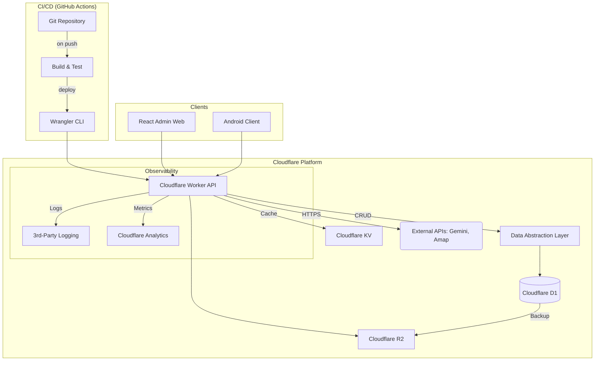

# FaceCheck 项目云架构全面分析与演进策略

**文档版本:** 1.0
**创建日期:** 2026-03-14

## 1. 现状分析报告

本文档对 `FaceCheck` 项目（以后端核心 `omniattend-core` 为主）的现有云架构进行全面分析，评估其优势、劣势，并为未来的发展和扩展提供战略规划。

### 1.1. 项目架构分析

- **核心组件**:
  - **`omniattend-core`**: 项目的核心，一个集成了前端与后端的应用。
    - **前端**: 基于 React (Vite) 和 TypeScript 构建的单页应用（SPA），为管理员提供管理界面。
    - **后端**: 基于 TypeScript 的 Serverless 函数，运行在 Cloudflare Workers 环境，负责处理所有业务逻辑和 API 请求。
  - **`FaceCheck` (安卓客户端)**: 原生安卓应用，作为数据采集和用户交互的终端，通过 API 与后端通信。

- **技术栈**:
  - **运行时**: Cloudflare Workers (Edge Computing)。
  - **语言**: TypeScript。
  - **前端框架**: React, Vite, Tailwind CSS。
  - **后端框架**: 无特定框架，采用原生 Workers API 和路由逻辑。
  - **部署工具**: Cloudflare Wrangler CLI。

- **架构评估**:
  - **伸缩性 (Scalability)**: **极高**。基于 Cloudflare 的全球边缘网络，架构本身是无状态和 Serverless 的，能够自动按需扩展以应对流量高峰，无需手动配置服务器容量。
  - **可用性 (Availability)**: **高**。依赖于 Cloudflare 全球网络的冗余和高可用特性。除非 Cloudflare 平台本身出现大规模故障，否则服务可用性有极高的保障。
  - **弹性 (Resilience)**: **中等**。应用对 Cloudflare 生态系统（特别是 D1 数据库）有较强依赖。D1 本身的故障可能影响整个应用。目前缺少跨区域容灾或数据库备份恢复的明确策略。

### 1.2. 数据层分析

- **数据存储**:
  - **结构化数据**: Cloudflare D1，一个基于 SQLite 的边缘数据库。用于存储所有核心业务数据，如 `Teacher`, `Student`, `Classroom`, `CheckinTask` 等。
  - **对象存储**: Cloudflare R2，一个兼容 S3 API 的对象存储服务。用于存储用户头像等二进制文件。
  - **缓存**: 当前未明确使用缓存服务（如 Cloudflare KV）。

- **数据模型与模式**:
  - **模型**: `schema.sql` 文件定义了清晰的关系型数据模型，表之间通过外键关联。
  - **读写模式**: 典型的 OLTP（在线事务处理）模式。读操作（如查询列表、详情）频率高于写操作（创建、更新）。写操作集中在考勤提交、信息修改等场景。
  - **一致性要求**: 业务要求强一致性。D1 作为集中式数据库（尽管分布在边缘），能够保证 ACID 特性，满足当前需求。

- **数据迁移评估**:
  - **现状**: 数据已在云端（D1）。
  - **风险**: **供应商锁定（Vendor Lock-in）**是主要风险。由于 D1 基于 SQLite，若未来需要迁移到其他主流数据库（如 PostgreSQL, MySQL），需要进行 SQL 方言的转换和数据导出/导入，复杂度较高。

### 1.3. 外部依赖和服务分析

- **第三方服务列表**:
  1.  **高德地图 API**: 用于前端的地理位置选择和逆地理编码。属于前端依赖，与后端云架构无直接耦合。
  2.  **Google Gemini API**: 用于后端的 AI 智能洞察。通过标准的 HTTPS 请求调用。

- **兼容性评估**:
  - 两种依赖都是通过标准的 HTTP API 集成，与云环境完全兼容。
  - **替代方案**: 高德地图可被 Google Maps API 或其他地图服务替代；Gemini API 可被 OpenAI GPT 系列、Anthropic Claude 等其他大语言模型 API 替代。替换成本主要在于适配 API 的请求和响应格式，工作量可控。

### 1.4. 网络与安全分析

- **网络通信**: 
  - **外部访问**: 所有客户端（Web 前端、安卓 App）通过 HTTPS 访问 Cloudflare Worker 提供的 API 端点。Cloudflare 自动处理 TLS 加密。
  - **内部通信**: 后端服务（Worker, D1, R2）之间的通信在 Cloudflare 的内部网络中进行，延迟低且安全性高。

- **安全机制**:
  - **认证**: 采用基于 `X-API-Key` 的共享密钥认证。这是一种简单有效的机制，但对于复杂的多租户或多权限场景，扩展性有限。
  - **授权**: 当前业务逻辑中未发现复杂的角色或权限控制（RBAC），默认为拥有 API Key 的请求拥有完全权限。
  - **数据加密**: 传输中数据由 HTTPS 保护；静态数据（D1, R2）由 Cloudflare 平台负责加密。
  - **合规性**: 依赖 Cloudflare 平台提供的合规性认证。若业务涉及特定行业（如医疗、金融），需额外评估 Cloudflare 是否满足相关法规。

### 1.5. 配置与环境管理分析

- **配置管理**: 
  - **非敏感配置**: `wrangler.toml` 文件管理，如服务名称、兼容性日期、D1 数据库绑定等。
  - **敏感配置**: `wrangler secret` 命令用于管理敏感信息（如 `API_KEY`），这些信息作为环境变量注入到 Worker 中。这是一种安全的实践。
- **环境隔离**: Wrangler 支持多环境配置（例如 `[env.staging]`, `[env.production]`), 可以为不同环境（开发、预发布、生产）配置不同的数据库、密钥和域名，实现环境隔离。当前项目似乎未使用此高级功能。

### 1.6. 日志、监控与可观测性分析

- **现状**: 这是当前架构的**主要薄弱环节**。
  - **日志**: 主要依赖 `console.log`，日志输出到 Cloudflare 仪表盘。缺乏结构化、可搜索的日志系统，问题排查困难。
  - **监控**: 依赖 Cloudflare 提供的基础指标（请求数、CPU 时间、错误率）。缺少业务层面的自定义监控和告警。
  - **可观测性**: 缺乏分布式追踪，无法完整跟踪一个请求从入口到数据库再到外部 API 的完整链路。

### 1.7. 部署与运维流程分析

- **现状**: 
  - **构建**: `npm run build` (Vite) 用于构建前端静态资源。
  - **部署**: 手动执行 `wrangler deploy` 命令进行部署。
  - **CI/CD**: 未发现自动化部署流程。
- **评估**: 当前流程简单直接，适合单人或小团队开发。但随着项目复杂度和团队规模的增长，手动部署容易出错且效率低下，是优化的关键点。

---

## 2. 云架构演进策略与迁移路线图

鉴于项目已在 Cloudflare 云上，本节重点是**架构优化和演进**的路线图。

- **第一阶段：基础强化 (Foundation Hardening) - (短期，1-2周)**
  - **目标**: 提升可观测性和部署效率，降低运维成本。
  - **任务**: 
    1.  **引入结构化日志**: 集成第三方日志服务（如 Logtail, Axiom, Datadog），将所有 `console.log` 替换为结构化日志调用，并附带请求 ID。
    2.  **建立 CI/CD 流水线**: 使用 GitHub Actions 创建一个自动化工作流。当代码合并到 `main` 分支时，自动执行测试、构建和 `wrangler deploy`。
    3.  **配置多环境**: 在 `wrangler.toml` 中配置 `staging` 和 `production` 环境，分别对应不同的 D1 数据库和密钥，实现开发/测试与生产的隔离。

- **第二阶段：服务解耦与韧性增强 (Decoupling & Resilience) - (中期，1-3个月)**
  - **目标**: 降低供应商锁定风险，提升系统韧性。
  - **任务**: 
    1.  **抽象数据层**: 在 `worker.ts` 中创建数据仓库（Repository）层，将所有 D1 数据库的直接查询封装起来。这使得未来更换数据库时，只需修改仓库层的实现，而业务逻辑层无需改动。
    2.  **数据库备份策略**: 研究并实施 D1 数据库的定期备份方案（例如，通过 Wrangler CLI 脚本定时导出到 R2）。
    3.  **引入缓存**: 对于不经常变化但读取频繁的数据（如班级列表），使用 Cloudflare KV 作为缓存层，降低对 D1 的读取压力。

- **第三阶段：高级扩展与安全加固 (Advanced Scaling & Security) - (长期)**
  - **目标**: 应对大规模用户增长和更复杂的业务需求。
  - **任务**: 
    1.  **评估数据库升级**: 当业务发展超出 D1（SQLite）的写并发或复杂查询能力时，启动数据库迁移计划，迁移到能从 Worker 访问的分布式数据库（如 Neon, PlanetScale）。
    2.  **升级认证授权**: 引入更专业的认证服务（如 Auth0, Clerk），或自建基于 JWT 的认证体系，以支持更精细的角色和权限控制（RBAC）。
    3.  **API 网关**: 考虑使用 Cloudflare API Gateway 对 API 进行更精细的速率限制、请求验证和路由管理。

---

## 3. 目标云架构设计草案 (增强版)

---

## 4. 潜在代码修改点清单

- **日志系统集成**: 
  - 在 `worker.ts` 中引入日志库，替换所有 `console.log`。
  - 在请求入口处生成唯一 `traceId`，并将其贯穿整个请求链路的日志。
- **数据层抽象**: 
  - 创建 `services/repository.ts` 或类似文件。
  - 将 `worker.ts` 中所有 `env.DB.prepare(...)` 的直接调用，迁移到 `repository.ts` 中，并导出为 `findStudentById`, `createClassroom` 等业务函数。
- **配置外部化**: 
  - 检查代码，确保没有硬编码的配置项（如 URL、默认值），所有配置都应通过 `env` 对象获取。
- **错误处理**: 
  - 统一 API 的错误返回格式，在 `catch` 块中返回结构化的错误信息，并记录详细的错误日志。

---

## 5. 资源需求和成本初步估算

- **当前成本**: **极低或免费**。Cloudflare 的免费套餐覆盖了大量的 Workers 调用、D1 读写次数、R2 存储和操作次数，对于当前项目规模绰绰有余。
- **未来成本**: 
  - **日志服务**: 第三方日志服务的费用通常基于日志量，早期阶段可能每月在 $0 - $20 之间。
  - **数据库升级**: 如果未来迁移到 Neon 或类似服务，预计成本将从每月 $15 - $25 起步，并随用量增加。
  - **Cloudflare 成本**: 随着用户量和 API 调用量的大幅增长，可能会超出免费额度，但其按量付费的价格仍然极具竞争力。

---

## 6. 风险评估和缓解计划

- **风险 1: 供应商锁定 (Vendor Lock-in)**
  - **描述**: 代码与 Cloudflare Workers 的运行时 API 和 D1 的 SQLite 方言深度绑定，迁移到其他云（如 AWS Lambda）成本高。
  - **缓解计划**: 
    1.  严格执行**第二阶段**的**数据层抽象**，这是最重要的解耦措施。
    2.  尽量使用 Web 标准 API（如 `fetch`），避免使用过多 Cloudflare 特有的 API。
    3.  保持对迁移到其他平台的成本和复杂度的清醒认识，并将其作为技术选型时的考量因素。

- **风险 2: D1 数据库的局限性**
  - **描述**: SQLite 在高并发写入和复杂分析查询（JOINs）方面存在性能瓶颈，可能成为未来业务发展的限制。
  - **缓解计划**: 
    1.  在 Cloudflare 仪表盘中密切监控 D1 的查询性能和错误率。
    2.  在**第二阶段**引入缓存（KV），减少对 D1 的读取压力。
    3.  提前进行技术预研，准备好备选的数据库方案（如 Neon），并制定详细的迁移预案。

- **风险 3: 单点故障**
  - **描述**: 尽管 Cloudflare 是全球分布的，但应用逻辑本身没有跨区域容灾设计。如果 D1 主数据库发生逻辑损坏或数据丢失，业务将中断。
  - **缓解计划**: 
    1.  实施**第二阶段**的**数据库备份策略**，确保有可恢复的数据副本。
    2.  对于关键的写操作，可以在 `SyncLog` 中增加一个 `processed` 状态，实现更可靠的“至少一次”处理保证。
