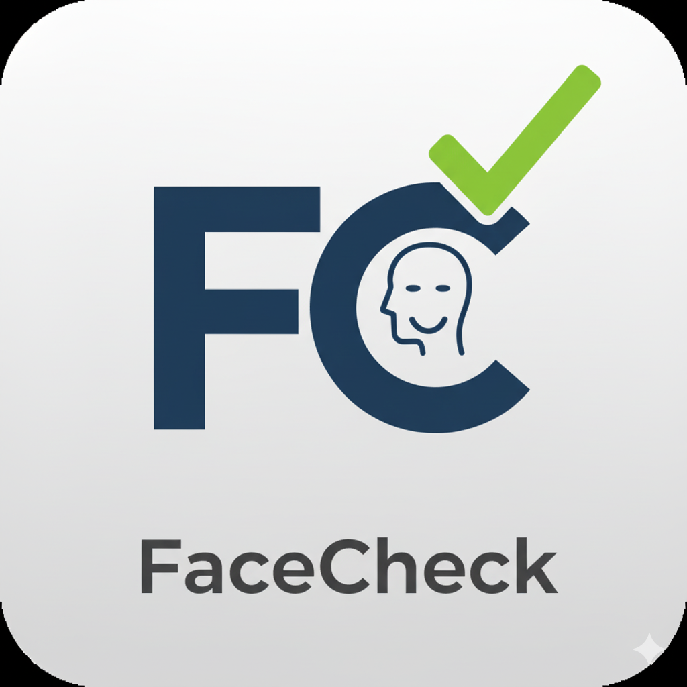

# FaceCheck - 智能人脸识别考勤系统

[](https://www.android.com/)
[](LICENSE)
[](https://kotlinlang.org/)

<div align="center">
  
  <br/>
  
</div>

## 📱 项目简介

<div align="center">
  
  <span style="font-size: 24px; font-weight: bold; vertical-align: middle;">FaceCheck 智能人脸识别考勤系统</span>
</div>

FaceCheck 是一款基于人脸识别技术的智能考勤系统，专为教育场景设计。系统采用先进的人脸识别算法，支持多人同时识别，提供完整的考勤管理解决方案。

### ✨ 核心特性

- **🎯 高精度人脸识别**：基于 Google ML Kit，支持多人脸同时检测与识别
- **📊 智能考勤管理**：完整的考勤流程，从拍照到结果统计
- **☁️ 云端数据同步**：WebDAV 协议支持，实现多设备数据同步
- **🔒 安全可靠**：本地+云端双重存储，保障数据安全
- **📱 现代化界面**：Material Design 设计，用户体验友好
- **⚡ 高性能处理**：异步处理机制，响应速度快

## 🏗️ 技术架构

### 核心技术栈

| 技术 | 用途 |
|------|------|
| **Google ML Kit** | 人脸检测与特征提取 |
| **SQLite** | 本地数据存储 |
| **WebDAV** | 云端数据同步 |
| **Glide** | 图片加载与缓存 |
| **Material Design** | UI 界面设计 |
| **MVVM 架构** | 应用架构模式 |

### 项目结构

```
com.example.facecheck/
├── ui/                    # UI 界面层
│   ├── auth/             # 认证相关界面
│   ├── attendance/       # 考勤功能界面
│   ├── face/             # 人脸识别界面
│   ├── profile/          # 用户资料界面
│   └── classroom/        # 教室管理界面
├── utils/                # 工具类
│   ├── FaceRecognitionManager.java    # 人脸识别管理器
│   ├── FaceDetectionManager.java      # 人脸检测管理器
│   ├── FaceImageProcessor.java        # 人脸图像处理
│   └── SyncManager.java               # 数据同步管理器
├── database/             # 数据库相关
├── sync/                 # 数据同步
├── webdav/               # WebDAV 通信
└── data/                 # 数据模型与仓库
```

## 🚀 快速开始

### 环境要求

- **Android Studio**: Arctic Fox 或更高版本
- **最低 Android 版本**: API 23 (Android 6.0)
- **目标 Android 版本**: API 34
- **Java/Kotlin**: JDK 11 或更高版本

### 安装步骤

1. **克隆仓库**
```bash
git clone https://github.com/tonygyf/FaceCheck.git
cd FaceCheck
```

2. **打开项目**
- 使用 Android Studio 打开项目根目录
- 等待 Gradle 同步完成

3. **配置项目**
- 在 `local.properties` 中添加必要的配置
- 检查依赖项是否正确下载

4. **构建与运行**
```bash
# 构建调试版本
./gradlew assembleDebug

# 安装到设备
./gradlew installDebug
```

### 开发环境配置

在 `local.properties` 文件中添加：

```properties
# WebDAV 配置（可选）
webdav.url=your_webdav_server_url
webdav.username=your_username
webdav.password=your_password
```

## 📋 功能详解

### 🔐 用户认证系统

- **用户注册**: 支持教师账户注册，用户名唯一性验证
- **安全登录**: 密码加密存储，支持记住密码功能
- **自动登录**: 基于 SharedPreferences 的自动登录机制
- **用户资料**: 完整的用户信息管理功能

### 👤 人脸识别核心

#### 人脸检测
- 基于 Google ML Kit 的多人脸检测
- 支持人脸轮廓、关键点检测
- 实时人脸质量评估

#### 特征提取
```java
// 256维特征向量提取
float[] features = faceRecognitionManager.extractFaceFeatures(bitmap, face);
```

#### 人脸比对
- 相似度阈值控制（默认 0.75）
- 支持批量人脸识别
- 识别结果可视化展示

### 📊 考勤管理

#### 考勤流程
1. **拍照采集**: 支持相机拍照和相册选择
2. **人脸检测**: 自动检测照片中的人脸
3. **特征比对**: 与数据库中的人脸特征进行比对
4. **结果统计**: 生成考勤统计报告

#### 考勤记录
- 完整的考勤会话管理
- 详细的考勤结果记录
- 支持考勤数据导出和分享

### ☁️ 数据同步

#### WebDAV 同步
- 支持主流 WebDAV 服务器（Nextcloud、ownCloud 等）
- 自动同步数据库和多媒体文件
- 增量同步机制，节省流量
- 同步状态实时监控

#### 同步内容
- 教师和学生信息
- 人脸特征数据
- 考勤记录和照片
- 系统配置信息

## 🛠️ 核心算法

### 人脸识别算法

```java
public RecognitionResult recognizeFace(Bitmap faceBitmap, Face face) {
    // 1. 提取人脸特征向量
    float[] queryFeatures = extractFaceFeatures(faceBitmap, face);
    
    // 2. 与数据库中的特征进行比对
    float bestSimilarity = calculateSimilarity(queryFeatures, storedFeatures);
    
    // 3. 返回识别结果
    return new RecognitionResult(studentId, similarity, status);
}
```

### 图像质量评估

```java
public static float calculateImageQuality(Bitmap bitmap) {
    // 计算图像清晰度、对比度等指标
    // 返回 0-1 的质量评分
}
```

## 📁 数据库设计

### 核心数据表

| 表名 | 描述 |
|------|------|
| `Teacher` | 教师账户信息 |
| `Student` | 学生基本信息 |
| `FaceEmbedding` | 人脸特征向量 |
| `AttendanceSession` | 考勤会话记录 |
| `AttendanceResult` | 考勤结果详情 |
| `PhotoAsset` | 照片资源管理 |
| `SyncLog` | 同步日志记录 |

## 🧪 测试与验证

### 性能指标

- **识别准确率**: > 95%（在标准测试集下）
- **识别速度**: < 500ms（单张人脸）
- **支持人脸数**: 同时识别 10+ 人脸
- **数据库容量**: 支持 10000+ 人脸特征存储

### 兼容性测试

- ✅ Android 6.0 - Android 14
- ✅ 各种屏幕尺寸和分辨率
- ✅ 不同厂商设备兼容性

## 🔧 开发指南

### 添加新功能

1. **遵循 MVVM 架构模式**
2. **使用 Repository 模式管理数据访问**
3. **异步操作使用 Kotlin 协程**
4. **UI 更新必须在主线程执行**

### 代码规范

- 使用 Kotlin 编码规范
- 添加必要的注释和文档
- 遵循 Material Design 设计原则
- 进行充分的异常处理

## 🤝 贡献指南

我们欢迎社区贡献！请遵循以下步骤：

1. Fork 本仓库
2. 创建特性分支 (`git checkout -b feature/AmazingFeature`)
3. 提交更改 (`git commit -m 'Add some AmazingFeature'`)
4. 推送到分支 (`git push origin feature/AmazingFeature`)
5. 创建 Pull Request

### 贡献类型

- 🐛 **Bug 修复**: 报告并修复程序错误
- ✨ **新功能**: 添加新的功能特性
- 📚 **文档**: 改进项目文档
- 🎨 **UI/UX**: 优化用户界面和体验
- ⚡ **性能**: 提升系统性能

## 📄 许可证

本项目采用 MIT 许可证 - 查看 [LICENSE](LICENSE) 文件了解详情。

## 🙏 致谢

- [Google ML Kit](https://developers.google.com/ml-kit) - 提供强大的人脸识别能力
- [Material Design](https://material.io/design) - 优秀的设计规范
- [Glide](https://github.com/bumptech/glide) - 高效的图片加载库

## 📞 支持与联系

- **项目地址**: [https://github.com/tonygyf/FaceCheck](https://github.com/tonygyf/FaceCheck)
- **问题反馈**: 请在 GitHub Issues 中提交
- **功能建议**: 欢迎提出新功能建议

---

**⭐ 如果这个项目对你有帮助，请给我们一个 Star！**
