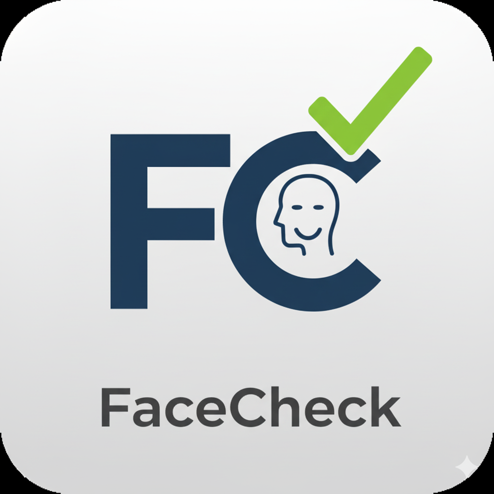

# FaceCheck - 智能人脸识别考勤系统

[](https://www.android.com/)
[](LICENSE)
[](https://kotlinlang.org/)

<p align="center">
  
  &nbsp;&nbsp;&nbsp;
  
</p>

## 📱 项目简介

FaceCheck 是面向教育场景的智能人脸识别考勤系统，现已切换为 **Cloudflare 云端网页 + 云数据库** 架构，使用 API 登录与云端同步替代 WebDAV 与本地切换模式。

### ✨ 核心特性

- **🎯 高精度人脸识别**：支持多人脸检测与识别
- **📊 智能考勤管理**：完整考勤流程与统计
- **☁️ 云端数据同步**：基于 Cloudflare API 的统一数据源
- **🔐 API 登录**：支持账号密码与邮箱验证码登录
- **📱 现代化界面**：Material Design 设计

## 🏗️ 技术架构

### 核心技术栈

| 技术 | 用途 |
|------|------|
| **Google ML Kit / FaceNet** | 人脸检测与特征提取 |
| **SQLite** | 本地缓存 |
| **Cloudflare Workers** | API 服务 |
| **Cloudflare D1** | 云数据库 |
| **React + Vite** | 云端网页管理端 |
| **MVVM 架构** | 应用架构模式 |

### 云端架构

```
Android 客户端
  ↕ API
Cloudflare Workers
  ↕
Cloudflare D1
```

## 🔐 登录与 API

### Base URL
`https://omni.gyf123.dpdns.org`

### 认证
所有请求需携带 API Key：
- Header: `X-API-Key`

### 登录接口

| 端点 | 方法 | 说明 |
|------|------|------|
| `/api/auth/login` | POST | 账号密码登录 |
| `/api/auth/email-code/send` | POST | 发送邮箱验证码 |
| `/api/auth/email-code/verify` | POST | 验证码登录 |

### 同步接口

| 端点 | 方法 | 说明 |
|------|------|------|
| `/api/sync/download` | GET | 拉取班级/学生/Embedding/考勤 |
| `/api/sync/upload` | POST | 上传考勤会话与结果 |

## 🚀 快速开始

### 环境要求

- **Android Studio**: Arctic Fox 或更高版本
- **最低 Android 版本**: API 23
- **目标 Android 版本**: API 34
- **Java/Kotlin**: JDK 11 或更高版本

### 构建与运行

```bash
./gradlew assembleDebug
./gradlew installDebug
```

### 运行前配置

需要在 App 内配置以下参数（由后端提供）：

- API Base URL：`https://omni.gyf123.dpdns.org`
- API Key：`X-API-Key`

## 📦 同步流程

1. 登录成功获取 teacherId
2. `GET /api/sync/download` 拉取完整数据
3. 本地缓存供离线使用
4. 考勤结束后 `POST /api/sync/upload` 上传会话与结果

## ✅ 兼容性与性能

- Android 6.0 - Android 14
- 人脸识别 < 500ms（单张）
- 支持多班级/多学生规模扩展

## 🧭 迁移说明

- WebDAV 同步与本地切换模式已弃用
- 所有数据以 Cloudflare D1 为唯一来源
- 账号登录与同步接口以 API 为准

## 📖 文档索引

- [网络接口规范](.trae/documents/网络接口规范.md)
- [云端改造整体计划](.trae/documents/FaceCheck 云端改造整体计划.md)

## 📄 许可证

本项目采用 MIT 许可证 - 查看 [LICENSE](LICENSE) 文件了解详情。
